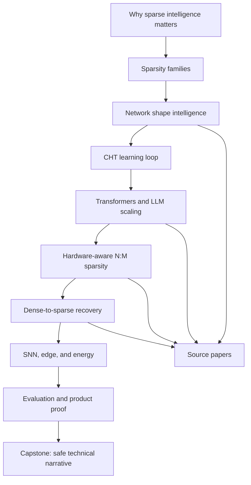

# CHT Course Map

This map shows how the course pieces fit together.

## Concept Ladder

| Level | Question | Where to learn |
|---|---|---|
| Motivation | Why do dense models become expensive? | Lessons 1-2 |
| Theory | Why can topology contain signal? | Lesson 3 |
| Algorithm | How does CHT update topology? | Lesson 4 |
| Scaling | What changes in Transformers and LLMs? | Lesson 5 |
| Systems | How does sparsity become speed? | Lesson 6 |
| Recovery | How do we convert dense models? | Lesson 7 |
| Deployment | Where do SNN and edge fit? | Lesson 8 |
| Product | What proves value? | Lesson 9 |

## Recommended Paths By Role

### Research

Read every lesson. Complete Labs 1, 2, and 3. Read the source index before choosing a reproduction target.

### Engineering

Prioritize lessons 4-7 and 9. Complete Labs 2, 3, and 4.

### Product / BD

Prioritize lessons 1, 2, 6, 7, and 9. Complete Lab 1 and the final capstone.

### Strategy

Prioritize lessons 1, 5, 6, 7, 9, and 10. Complete the final capstone as an investor/customer-safe narrative.

